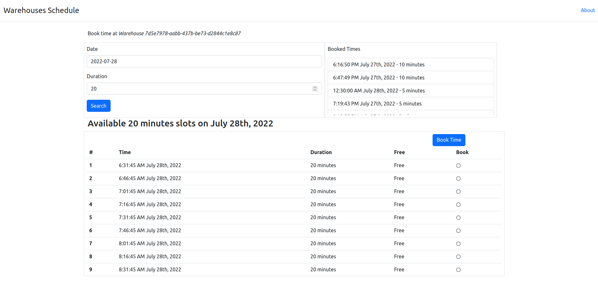

### Warehouses Schedule

This app allows to:
* select warehouse;
* see booked times
* find available time slots for specific day and duration
* book time slots

[Demo Link](https://blue-glitter-8651.fly.dev/)



### Setup
Requirements:
* Ruby 3.1.1
* Node 16
* Postgres ([installation manual](https://www.postgresql.org/download/))

Setup app
```
  git clone git@github.com:pucinsk/warehouses-schedule.git
  bundle
```

Setup database
```
cp config/database_sample.yml config/database.yml
rails db:prepare
```

Run
```
bin/dev
# or
rails s
yarn build --watch
```
